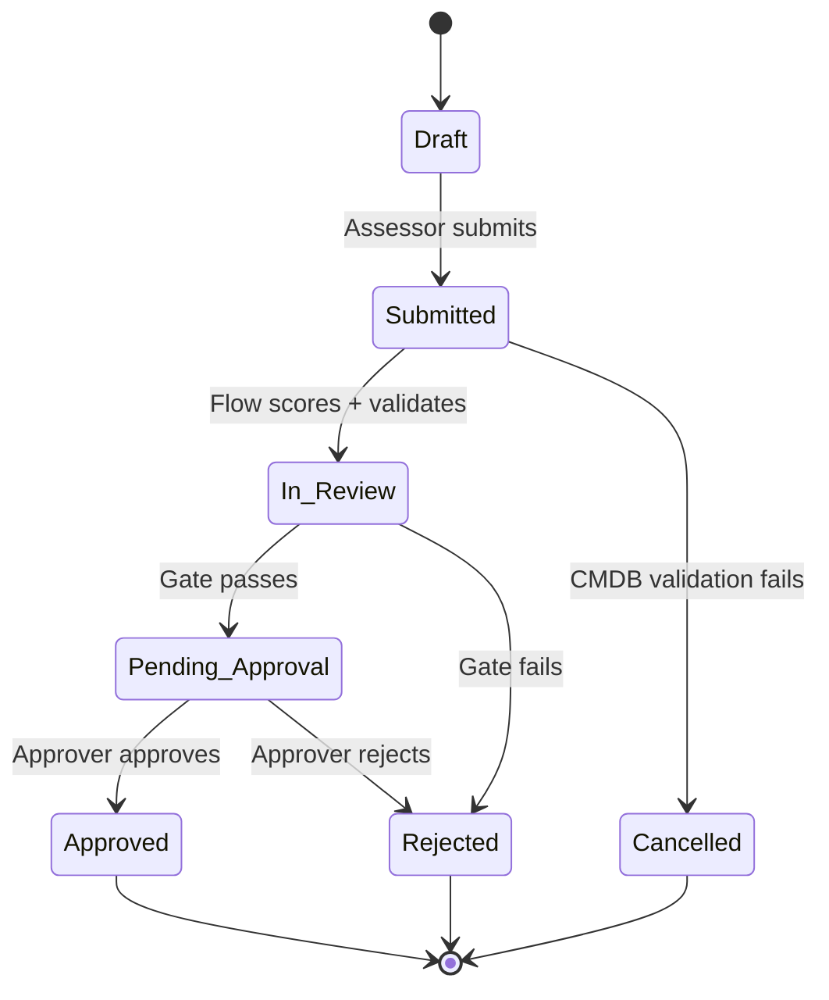
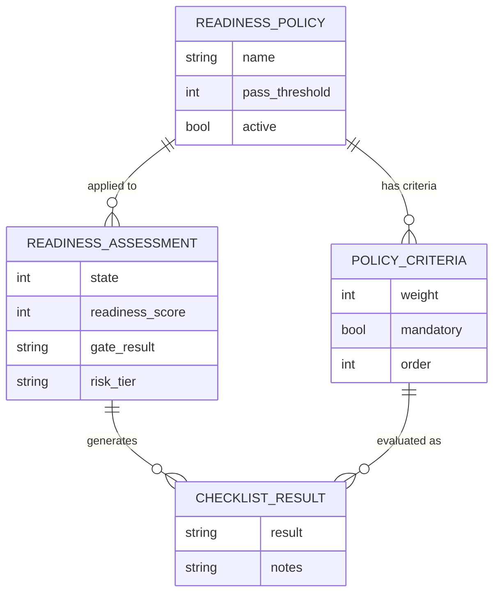

# Diagrams

> This directory contains architecture and flow diagrams for SentinelOps.  
> Diagrams are referenced in `docs/architecture.md` and `docs/flow-specifications.md`.  
> Diagrams are authored during Phase 7 (Demo Polish) and exported as PNG/SVG.

---

## Diagram Inventory

| Filename | Description | Format | Phase |
|---|---|---|---|
| *(pending)* | State machine — lifecycle transitions | PNG / Mermaid | Phase 7 |
| *(pending)* | Entity relationship diagram — 4 tables | PNG / Mermaid | Phase 7 |
| *(pending)* | ACL model — role × table × operation matrix | PNG | Phase 7 |
| *(pending)* | Flow Designer — FL-001 orchestration flow | PNG | Phase 7 |
| *(pending)* | Flow Designer — SF-001 CMDB validation subflow | PNG | Phase 7 |
| *(pending)* | Flow Designer — SF-002 score calculation subflow | PNG | Phase 7 |
| *(pending)* | Scoring engine — weighted algorithm flowchart | PNG | Phase 7 |
| *(pending)* | Component architecture — high-level system overview | PNG | Phase 7 |

---

## Naming Convention

```
{subject}_{type}_{YYYY-MM-DD}.{ext}

Examples:
  state_machine_lifecycle_2026-06-01.png
  erd_four_tables_2026-06-01.png
  flow_fl001_orchestration_2026-06-01.png
  scoring_algorithm_flowchart_2026-06-01.png
```

---

## Tooling

| Diagram Type | Recommended Tool |
|---|---|
| State machine, ERD, flow diagrams | [Mermaid](https://mermaid.js.org/) — inline in markdown, export to PNG |
| ACL matrix visual | Table screenshot from `docs/security-model.md` |
| ServiceNow Flow Designer screenshots | ServiceNow PDI — screenshot during Phase 7 |
| System architecture overview | [draw.io](https://draw.io) or Mermaid |

---

## Mermaid State Machine (Source — Reference)

The following Mermaid source produces the SentinelOps lifecycle state machine diagram.  
Render at [mermaid.live](https://mermaid.live) or embed in `docs/architecture.md`.



---

## Mermaid ERD (Source — Reference)


